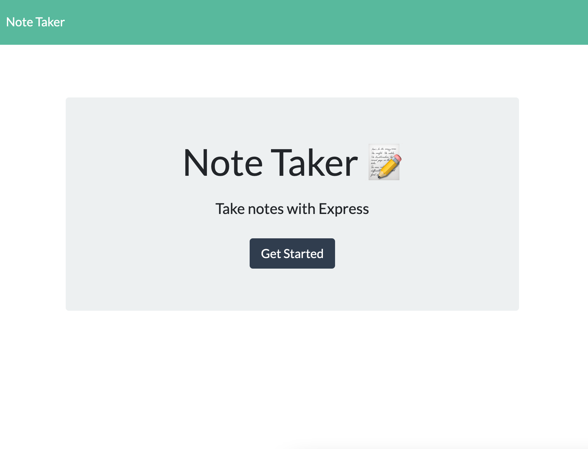
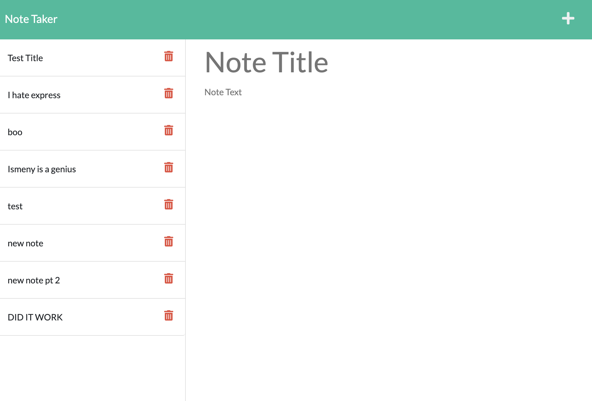

# Note Taker

## Description
This is a Note Taker app that can be used to write and save notes. This application uses an Express.js back end and will save and retrieve note data from a JSON file.

## Usage 
1. Click on 'Get Started' button on the landing page.
2. You will then be presented with the Notes page. Here you can click the little plus '+' icon in the right top corner. 
3. You can now click the upper section on the blank 'New Note' section to give your new note a title and click anywhere in the 'Note Text'.
4. Once you're done with your note you will now see a save icon '💾' in white and you can click this and it will save your new note and be listed on the left side on the list.
5. You can now click your note whenever you would like to view it again.

#### Landing page

#### Note Page

### Credits
- Ismeny Saguillan
- Express.js package

### License 

